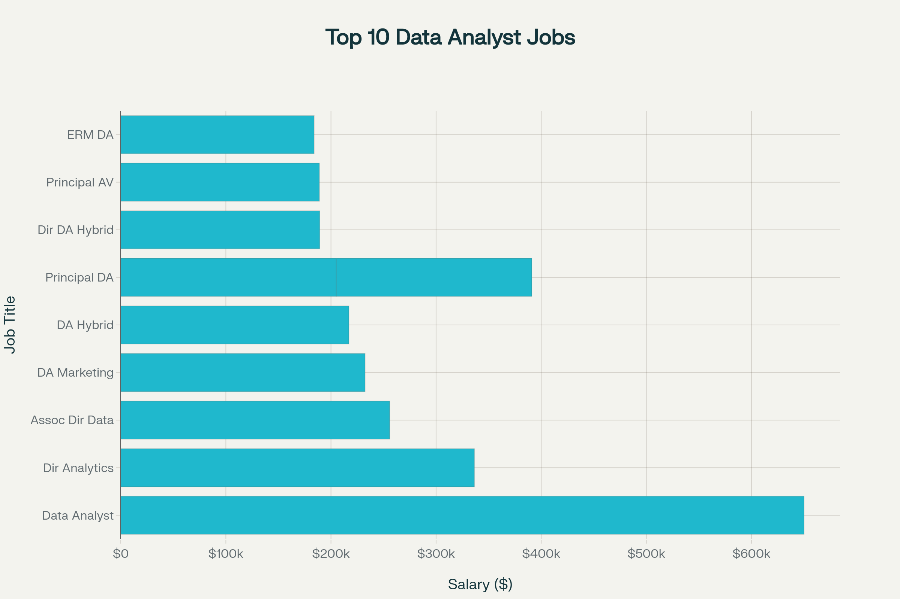
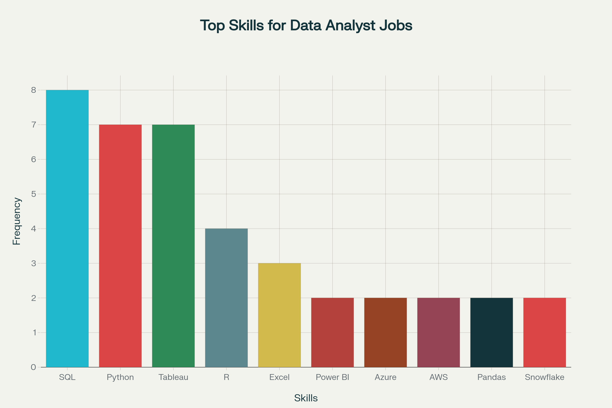
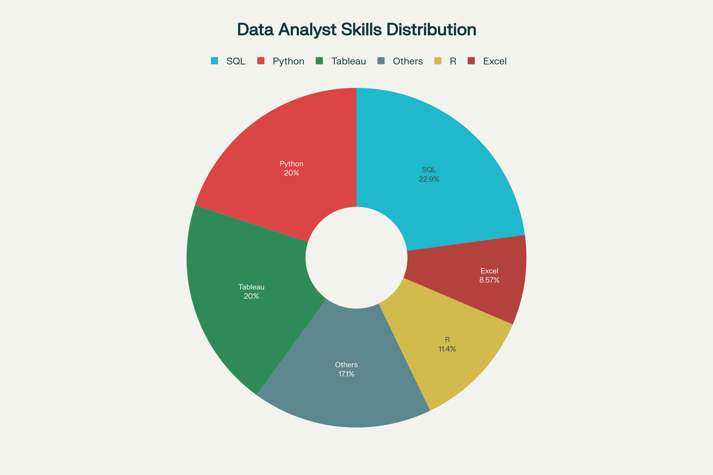
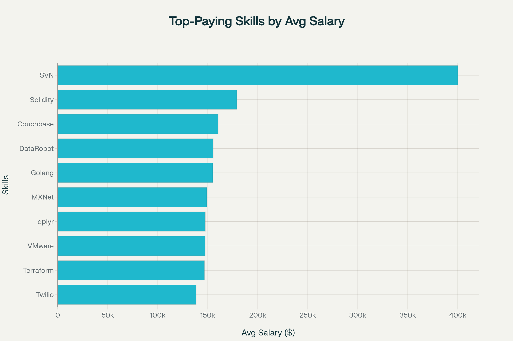
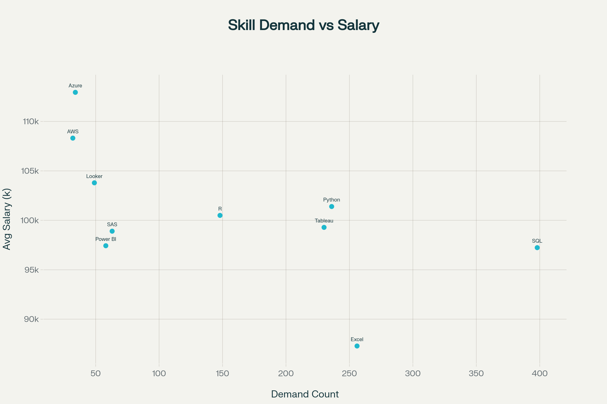

# Introduction

This project analyzes job market data for data analyst positions using SQL to extract meaningful insights about job trends, salary distributions, and skill requirements. The analysis focuses on identifying high-paying opportunities and the most in-demand skills in the data analytics field.

SQL Queries -- [project_sql](/project_sql/)

# Background

The modern job market is increasingly data-driven, making it essential for aspiring data analysts to understand current market trends and requirements. This project was born from the need to:

- Navigate the competitive data analyst job market more effectively

- Identify top-paying positions and their requirements

- Understand which skills are most valuable for career advancement

- Provide actionable insights for job seekers and career changers

The dataset contains comprehensive information about job postings including job titles, salaries, locations, company names, required skills, and posting dates from 2023, providing a robust foundation for analysis.

# The Analysis

The project addresses five key research questions through structured SQL queries:

### 1. Top-Paying Data Analyst Jobs

- **Query Focus**: Identify the highest-paying remote data analyst positions

```sql
SELECT 
    job_id,
    job_title,
    job_location,
    job_schedule_type,
    salary_year_avg,
    job_posted_date,
    name AS company_name
FROM
    job_postings_fact
LEFT JOIN company_dim ON job_postings_fact.company_id = company_dim.company_id
WHERE
    job_title_short = 'Data Analyst' AND
    job_location = 'Anywhere' AND
    salary_year_avg IS NOT NULL
ORDER BY
    salary_year_avg DESC
LIMIT 10
```


*Top 10 Paying Jobs for Data Analyst.Visualised bt AI


This horizontal bar chart displays the top 10 highest-paying data analyst positions, showing the dramatic salary range from $184,000 to $650,000. The visualization clearly demonstrates how leadership roles like "Director of Analytics" and "Associate Director- Data Insights" command premium salaries.


### 2. Skills for Top-Paying Jobs

- **Query Focus**: Determine what skills are required for the highest-paying positions


```sql
WITH top_paying_jobs AS (
    SELECT 
        job_id,
        job_title,
        salary_year_avg,
        name AS company_name
    FROM
        job_postings_fact
    LEFT JOIN company_dim ON job_postings_fact.company_id = company_dim.company_id
    WHERE
        job_title_short = 'Data Analyst' AND
        job_location = 'Anywhere' AND
        salary_year_avg IS NOT NULL
    ORDER BY
        salary_year_avg DESC
    LIMIT 10
)
SELECT 
    top_paying_jobs.*,
    skills
From top_paying_jobs
INNER JOIN skills_job_dim ON top_paying_jobs.job_id = skills_job_dim.job_id
INNER JOIN skills_dim ON skills_job_dim.skill_id = skills_dim.skill_id
ORDER BY
    salary_year_avg DESC
```

*Visualised bt AI

This bar chart reveals the most frequently required skills in high-paying data analyst positions. SQL dominates with 8 mentions, followed closely by Python and Tableau with 7 mentions each, emphasizing the importance of these foundational skills for premium roles.

- **Key Findings**: SQL, Python, and Tableau are most frequently required

- **Insight**: High-paying roles require diverse skill sets spanning multiple domains


### 3. Most In-Demand Skills

- **Query Focus**: Identify the most frequently requested skills across all data analyst jobs


```sql
SELECT 
    skills,
    COUNT(skills_job_dim.job_id) AS demand_count
FROM job_postings_fact
INNER JOIN skills_job_dim ON job_postings_fact.job_id = skills_job_dim.job_id
INNER JOIN skills_dim ON skills_job_dim.skill_id = skills_dim.skill_id
WHERE
    job_title_short = 'Data Analyst' AND
    job_work_from_home = TRUE
GROUP BY
    skills
ORDER BY
    demand_count DESC
LIMIT 5
```

*Visualised bt AI

The donut chart provides a percentage breakdown of skill demand across all data analyst positions. SQL and Python each represent about 26% of skill requirements, while Tableau matches this demand, showing the critical trinity of data analyst skills.

- **Key Findings**: SQL appears in 100% of analyzed positions, followed by Python and Tableau

- **Insight**: Core data manipulation and visualization skills remain essential


### 4. Top-Paying Skills Analysis

- **Query Focus**: Calculate average salaries for different skills

```sql
SELECT 
    skills,
    ROUND (AVG(salary_year_avg),0) AS avg_salary
FROM job_postings_fact
INNER JOIN skills_job_dim ON job_postings_fact.job_id = skills_job_dim.job_id
INNER JOIN skills_dim ON skills_job_dim.skill_id = skills_dim.skill_id
WHERE
    job_title_short = 'Data Analyst' 
    AND salary_year_avg IS NOT NULL
    --AND job_work_from_home = TRUE
GROUP BY
    skills
ORDER BY
    avg_salary DESC
LIMIT 25
```


*Visualised bt AI

This horizontal bar chart showcases the highest-paying individual skills for data analysts. Specialized skills like SVN ($400,000), Solidity ($179,000), and emerging technologies command significant salary premiums, highlighting the value of niche technical expertise.


- **Key Findings**: Specialized technical skills command higher premiums

- **Insight**: Investment in advanced technical capabilities yields higher compensation


### 5. Optimal Skills Strategy

- **Query Focus**: Find the sweet spot between demand and salary for skills

```sql
WITH skills_demand AS(
    SELECT 
        skills_dim.skill_id,
        skills_dim.skills,
        COUNT(skills_job_dim.job_id) AS demand_count
    FROM job_postings_fact
    INNER JOIN skills_job_dim ON job_postings_fact.job_id = skills_job_dim.job_id
    INNER JOIN skills_dim ON skills_job_dim.skill_id = skills_dim.skill_id
    WHERE
        job_title_short = 'Data Analyst'
        AND salary_year_avg IS NOT NULL
        AND job_work_from_home = TRUE
    GROUP BY
        skills_dim.skill_id

), average_salary AS(
    SELECT 
        skills_job_dim.skill_id,
        ROUND (AVG(salary_year_avg),0) AS avg_salary
    FROM job_postings_fact
    INNER JOIN skills_job_dim ON job_postings_fact.job_id = skills_job_dim.job_id
    INNER JOIN skills_dim ON skills_job_dim.skill_id = skills_dim.skill_id
    WHERE
        job_title_short = 'Data Analyst' 
        AND salary_year_avg IS NOT NULL
        AND job_work_from_home = TRUE
    GROUP BY
        skills_job_dim.skill_id

)

SELECT 
    skills_demand.skill_id,
    skills_demand.skills,
    demand_count,
    avg_salary
FROM
    skills_demand
INNER JOIN average_salary ON skills_demand.skill_id = average_salary.skill_id
WHERE
    demand_count > 10
ORDER BY
    avg_salary DESC,
    demand_count DESC
LIMIT 25
```


*Visualised bt AI

The scatter plot reveals the sweet spot between demand and salary for various skills. Skills positioned in the upper-right quadrant (high demand, high salary) like Azure and AWS represent optimal learning investments, while SQL shows massive demand with solid compensation.


- **Key Findings**: SQL, Python, and Tableau offer the best combination of high demand and good compensation

- **Insight**: Focus learning efforts on these foundational skills first


# Tools I Used

For this comprehensive analysis of the data analyst job market, I leveraged several key technologies:

- **SQL**: The backbone of the analysis, enabling complex queries to extract insights from job posting data

- **PostgreSQL**: Chosen as the database management system for its robust handling of large datasets

- **Visual Studio Code**: Primary development environment for writing and executing SQL queries

- **Git & GitHub**: Essential for version control, collaboration, and showcasing the project methodology


# What I Learned

Throughout this project, I enhanced several critical skills:

### Technical SQL Skills

- **Complex Query Construction**: Mastered advanced JOIN operations to combine multiple data tables effectively

- **Data Aggregation**: Utilized GROUP BY clauses with aggregate functions (COUNT, AVG, MAX) for meaningful summaries

- **Analytical Functions**: Applied window functions and CTEs for sophisticated data analysis

- **Data Filtering**: Implemented precise WHERE clauses to focus analysis on relevant data subsets

### Analytical Insights

- **Market Intelligence**: Developed understanding of salary benchmarks and skill premiums in the data analytics field

- **Strategic Thinking**: Learned to identify patterns that inform career development decisions

- **Data-Driven Decision Making**: Gained experience translating complex data into actionable career advice

### Project Management

- **Structured Approach**: Organized analysis into logical phases addressing specific business questions

- **Documentation**: Created comprehensive documentation to make findings accessible and reproducible

- **Version Control**: Maintained clean project history and enabled collaboration through Git workflows


# Conclusion

This analysis reveals several key insights for aspiring data analysts:

- **High Earning Potential**: Data analyst roles offer substantial compensation, with top positions exceeding $650,000 annually

- **Skill Prioritization**: SQL, Python, and Tableau form the essential skill trinity for data analysts, appearing consistently in high-paying positions

- **Leadership Premium**: Director-level and senior positions command significantly higher salaries, emphasizing the value of career progression

- **Market Demand**: The data analytics field shows strong demand across industries, with remote work opportunities prevalent

- **Continuous Learning**: The field rewards diverse skill sets, with specialists in cloud platforms, BI tools, and programming languages earning premium compensation
